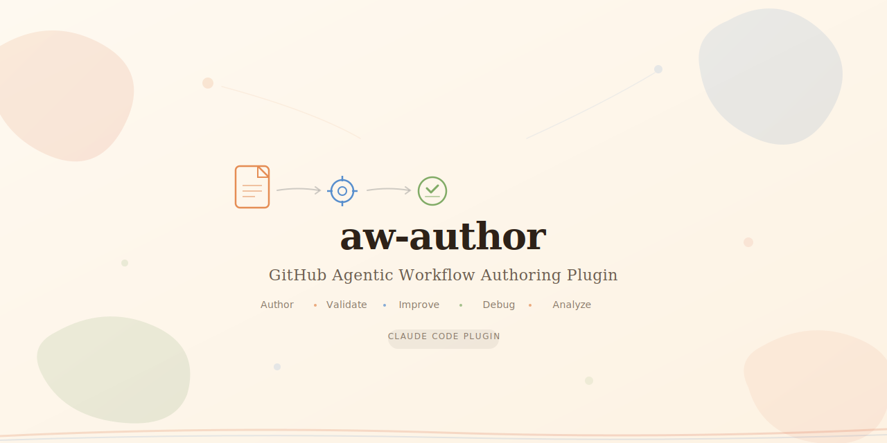

# aw-author

[](LICENSE)
[](https://docs.anthropic.com/en/docs/claude-code)
[](https://github.github.com/gh-aw/)

<picture>
  <source media="(prefers-color-scheme: dark)" srcset=".github/social-preview-dark.svg">
  <source media="(prefers-color-scheme: light)" srcset=".github/social-preview.svg">
  
</picture>

A Claude Code plugin for authoring, validating, and improving [GitHub Agentic Workflow](https://github.github.com/gh-aw/) (gh-aw) markdown files.

gh-aw workflows are markdown files with YAML frontmatter that define agentic automation, compiled into GitHub Actions via `gh aw compile`. This plugin provides guided tooling to create, validate, improve, and debug those workflow files directly from Claude Code.

## Features

- **Interactive authoring** — step-by-step guided workflow creation with prompts for triggers, engines, tools, safe-outputs, security, and prose body
- **One-shot generation** — describe what you need and get a complete workflow file
- **Validation** — check existing workflows against the gh-aw spec (frontmatter schema, body structure, cross-reference integrity)
- **Improvement analysis** — gap analysis, pattern matching against orchestration patterns, and quality scoring across completeness, security, clarity, and robustness
- **Debug assistance** — diagnose compilation errors, runtime failures, and behavioral issues
- **Spec queries** — answer questions about gh-aw capabilities, syntax, and best practices
- **Deep analysis agent** — delegate thorough multi-file reviews, security audits, and cross-workflow analysis to the `aw-analyst` agent

<picture>
  
</picture>

## Installation

Add the plugin to your Claude Code configuration:

```bash
claude plugin add /path/to/github-agentic-workflows
```

Or clone and register:

```bash
git clone https://github.com/zircote/github-agentic-workflows.git
claude plugin add ./github-agentic-workflows
```

## Usage

### Slash Command

```text
/aw-author                    # Auto-detect mode or prompt for selection
/aw-author new                # Interactive guided workflow creation
/aw-author generate           # One-shot generation from a description
/aw-author validate           # Validate an existing workflow file
/aw-author improve            # Analyze and suggest improvements
/aw-author debug              # Debug a failing workflow
/aw-author <question>         # Ask about gh-aw capabilities
```

### Examples

```text
/aw-author new
/aw-author generate an issue triage workflow for a public Go repo
/aw-author validate ./workflows/triage.md
/aw-author improve ./workflows/daily-report.md
/aw-author debug "workflow times out after 5 minutes"
/aw-author what engines are available?
/aw-author how do safe-outputs work?
/aw-author show me a ChatOps workflow example
```

## Plugin Structure

```
.claude-plugin/
  plugin.json           # Plugin manifest
agents/
  aw-analyst.md         # Deep analysis agent for multi-file review and audits
commands/
  aw-author.md          # /aw-author slash command entry point
skills/
  aw-author/
    SKILL.md            # Core skill with mode detection and guided workflows
    references/
      frontmatter-schema.md   # Complete YAML frontmatter field reference
      tools-reference.md      # All tool types and configuration
      safe-outputs.md         # Full safe-output catalog and constraints
      markdown-body.md        # Prose body best practices
      orchestration.md        # Workflow orchestration patterns
      validation.md           # Validation checklist and common failures
      examples.md             # Annotated example workflows
      llms-resources.md       # Links to canonical gh-aw documentation
```

## Modes

| Mode | Purpose | Trigger Phrases |
|------|---------|-----------------|
| Interactive | Guided step-by-step workflow creation | "new", "create", "write", "build" |
| Generate | One-shot workflow from a description | "generate", "one-shot", "quick" |
| Validate | Check a workflow against the spec | "validate", "check", "verify", "lint" |
| Improve | Suggest improvements for a workflow | "improve", "optimize", "refine", "review" |
| Debug | Diagnose a failing workflow | "debug", "fix", "broken", "failing", "error" |
| Query | Answer questions about gh-aw | Any question about capabilities or syntax |

## Reference Spec

The plugin embeds a curated subset of the gh-aw specification. For the full authoritative spec, the plugin can fetch from:

- [`llms-full.txt`](https://github.github.com/gh-aw/llms-full.txt) — complete specification
- [`llms-small.txt`](https://github.github.com/gh-aw/llms-small.txt) — abridged version
- [`agentic-workflows.txt`](https://github.github.com/gh-aw/_llms-txt/agentic-workflows.txt) — 100+ production patterns from the Agent Factory

## License

MIT
